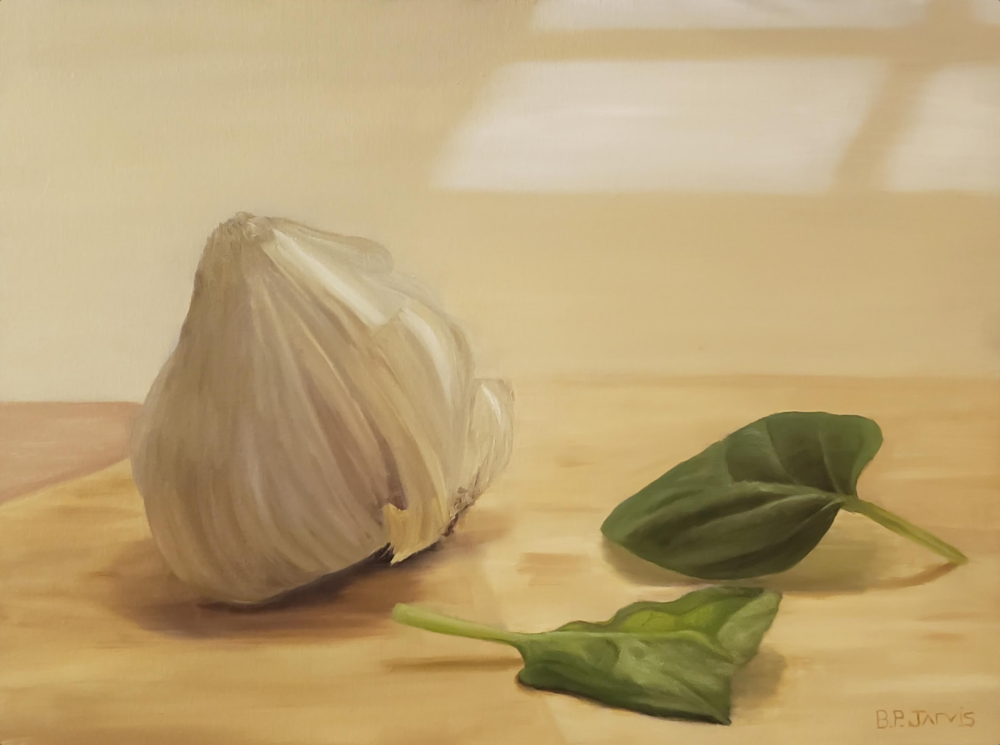

# art-viz

 Hanging art simulation tool using Blender command line tools & Python. Visualize how your art will look hanging on a wall with photo-realistic, computer-generated lighting.

> This repository is in active development. Check again in the future for future developments.

- [art-viz](#art-viz)
  - [Usage](#usage)
  - [Dependencies](#dependencies)
  - [Development](#development)
  - [Args](#args)
    - [Blender Command Line Args](#blender-command-line-args)
    - [Image Path](#image-path)
    - [Width](#width)
    - [Height](#height)
    - [Depth](#depth)
    - [Renderer](#renderer)
    - [Frame Type](#frame-type)
  - [Framing Options](#framing-options)
  - [Tips](#tips)

## Usage
 
 `blender -b <filename> -P <this_script> -- <image_path> <width-inches> <height-inches> <depth-inches> <renderer> <frameType>`

**Example:** `blender -b .\art-viz.blend -P render.py  -- .\garlic.jpg 18 24 1 CYCLES WoodFloatingFrame02`

***Original***

***Result***

*More frames will be added in future updates soon!*

[:arrow_up: Back to Top](#art-viz)

## Dependencies

- Blender 2.8+
  - Created using 2.93
- Blender executable folder **must** be added to PATH to run the `blender` cmd
- Python 2.8+
  - Created using 3.8.2

## Development

- [x] Render scene via command line

- [x] Import image and apply to material

- [x] Export render to absolute file path

- [x] Resize canvas via args

- [x] Select renderer via args

- [x] Design custom frames

- [x] Select frame type via args

- [ ] Set wall color via args

- [ ] Activate decor objects via args & json

[:arrow_up: Back to Top](#art-viz)

## Args

### Blender Command Line Args

Start by copy and pasting this before you add custom args:

`blender -b .\art-viz.blend -P render.py   --`

Everything that comes after `--` will be user-defined arguments, parsed in `render.py`.

Separate custom arguments with spaces after the `--` symbol. There must be a space on either side of the `--`.

### Image Path

ex: `apples.png`

This should be an image that exists in the root folder of this repository. Example use case could be a raw, cropped picture of a finished piece. Include the file extension in the name.

### Width

ex: `20`

The width of the real piece in inches.

### Height

ex: `16`

The height of the real piece in inches.

### Depth

ex: `.75`

The depth of the real piece in inches.

### Renderer

The type of renderer that Blender will use.

Options are `CYCLES`, `BLENDER_EEVEE`, or `BLENDER_WORKBENCH`.

### Frame Type

The frame that will surround the piece.

[:arrow_up: Back to Top](#art-viz)

## Framing Options

Current `frameType` options are:

`WhiteFloatingFrame`

[:arrow_up: Back to Top](#art-viz)

---

`BlackFloatingframe`

[:arrow_up: Back to Top](#art-viz)

---

`WoodFloatingFrame01`

[:arrow_up: Back to Top](#art-viz)

---

`WoodFloatingFrame02`

[:arrow_up: Back to Top](#art-viz)

---

`WoodFloatingFrame03`

[:arrow_up: Back to Top](#art-viz)

---

`WoodFloatingFrame04`

[:arrow_up: Back to Top](#art-viz)

---

`WoodFloatingFrame05`

[:arrow_up: Back to Top](#art-viz)

> :exclamation:This list will be added to in the near future for more interesting customization

## Tips

- If the result is too small, double the size values (height/width/depth) to make the art appear larger in the final image

[:arrow_up: Back to Top](#art-viz)
